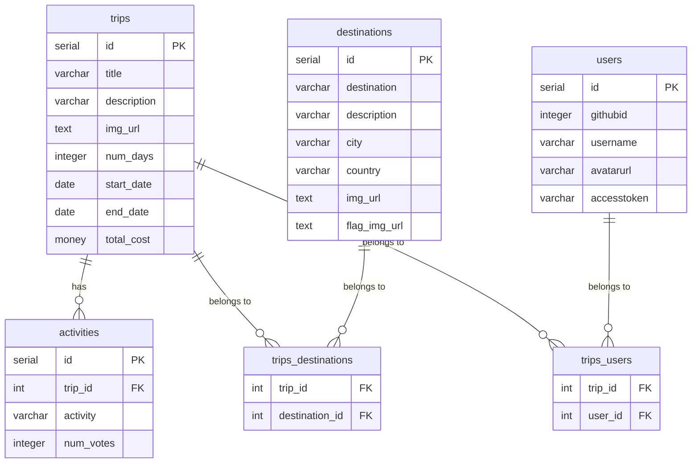

# On The Fly

On The Fly is a travel planning REST API that allows users to manage trips, destinations, and activities. It provides full CRUD functionality for each resource and supports many-to-many relationships between trips and destinations.

## Tech Stack

| Layer | Technology |
|---|---|
| Runtime | Node.js |
| Framework | Express.js |
| Database | PostgreSQL (hosted on Render) |
| ORM / Query | pg (node-postgres) |
| Environment | dotenv |
| Dev Server | nodemon |

## Project Structure

```
onthefly/
├── package.json
└── server/                     # Endpoints and their respective routers are declared here using app.use()
    ├── server.js               # Express app entry point
    ├── .env                    # Environment variables (not committed)
    ├── routes/                 # Routes are declared here to be able to connect the controller SQL functions to actual HTTP requests/paths
    │   ├── trips.js
    │   ├── activities.js
    │   ├── destinations.js
    │   └── trips_destinations.js
    └── config/
        ├── database.js         # pg pool connection
        ├── dotenv.js           # dotenv configuration
        ├── reset.js            # Table creation and seed script
        ├── data/
        │   └── data.json       # Seed data for trips
        └── controllers/        # Where the SQL queries are written to connect to the postgres database
            ├── trips.js
            ├── activities.js
            ├── destinations.js
            └── trips_destinations.js
```

## Database Schema




### trips
| Column | Type | Constraints |
|---|---|---|
| id | serial | PRIMARY KEY |
| title | varchar(100) | NOT NULL |
| description | varchar(500) | NOT NULL |
| img_url | text | NOT NULL |
| num_days | integer | NOT NULL |
| start_date | date | NOT NULL |
| end_date | date | NOT NULL |
| total_cost | money | NOT NULL |

### destinations
| Column | Type | Constraints |
|---|---|---|
| id | serial | PRIMARY KEY |
| destination | varchar(100) | NOT NULL |
| description | varchar(500) | NOT NULL |
| city | varchar(100) | NOT NULL |
| country | varchar(100) | NOT NULL |
| img_url | text | NOT NULL |
| flag_img_url | text | NOT NULL |

### activities
| Column | Type | Constraints |
|---|---|---|
| id | serial | PRIMARY KEY |
| trip_id | int | NOT NULL, FK → trips(id) |
| activity | varchar(100) | NOT NULL |
| num_votes | integer | DEFAULT 0 |

### trips_destinations (join table)
| Column | Type | Constraints |
|---|---|---|
| trip_id | int | NOT NULL, FK → trips(id) ON UPDATE CASCADE |
| destination_id | int | NOT NULL, FK → destinations(id) ON UPDATE CASCADE |

### users
| Column | Type | Constraints |
|---|---|---|
| id | serial | PRIMARY KEY |
| githubid | integer | NOT NULL |
| username | varchar(100) | NOT NULL |
| avatarurl | varchar(500) | NOT NULL |
| accesstoken | varchar(500) | NOT NULL |

### trips_users (join table)
| Column | Type | Constraints |
|---|---|---|
| trip_id | int | NOT NULL, FK → trips(id) ON UPDATE CASCADE |
| user_id | int | NOT NULL, FK → users(id) ON UPDATE CASCADE |

## API Endpoints

### Trips — `/trips`

| Method | Endpoint | Description |
|---|---|---|
| GET | `/trips` | Retrieve all trips |
| GET | `/trips/:id` | Retrieve a single trip by ID |
| POST | `/trips` | Create a new trip |
| PATCH | `/trips/:id` | Update a trip by ID |
| DELETE | `/trips/:id` | Delete a trip and its activities by ID |

### Activities — `/activities`

| Method | Endpoint | Description |
|---|---|---|
| GET | `/activities` | Retrieve all activities |
| GET | `/activities/:trip_id` | Retrieve all activities for a specific trip |
| POST | `/activities/:trip_id` | Create a new activity for a trip |
| PATCH | `/activities/:id` | Update the vote count for an activity |
| DELETE | `/activities/:id` | Delete an activity by ID |

### Destinations — `/destinations`

| Method | Endpoint | Description |
|---|---|---|
| GET | `/destinations` | Retrieve all destinations |
| GET | `/destinations/:id` | Retrieve a single destination by ID |
| POST | `/destinations` | Create a new destination |
| PATCH | `/destinations/:id` | Update a destination by ID |
| DELETE | `/destinations/:id` | Delete a destination by ID |

### Trips & Destinations — `/trips_destinations`

| Method | Endpoint | Description |
|---|---|---|
| GET | `/trips_destinations` | Retrieve all trip-destination associations |
| GET | `/trips_destinations/trips/:destination_id` | Retrieve all trips associated with a destination |
| GET | `/trips_destinations/destinations/:trip_id` | Retrieve all destinations associated with a trip |
| POST | `/trips_destinations` | Create a new trip-destination association |

## Getting Started

### Prerequisites

- Node.js
- A PostgreSQL database (local or hosted on Render)

### Setup

1. Clone the repository:
   ```bash
   git clone https://github.com/BrandonnGonzalez/onthefly.git
   cd onthefly
   ```

2. Install dependencies:
   ```bash
   npm install
   ```

3. Create a `.env` file inside the `server/` directory:
   ```
   PGUSER=your_db_user
   PGPASSWORD=your_db_password
   PGHOST=your_db_host
   PGPORT=5432
   PGDATABASE=your_db_name
   NODE_ENV=development
   ```

4. Start the server (this will reset and seed the database, then start nodemon):
   ```bash
   npm start
   ```

The API will be available at `http://localhost:3001`.

### Reset and Seed Database Only

To drop and recreate all tables and reseed trip data without starting the server:

```bash
npm run reset
```
